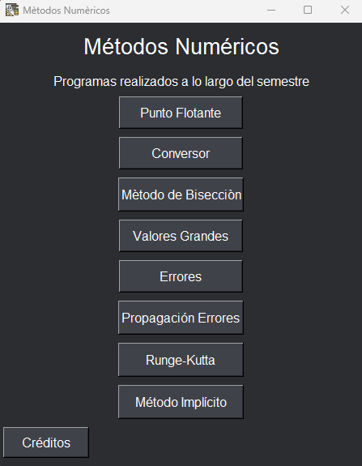

  <h1>Métodos Numéricos</h1>

En este repositorio se presentan los proyectos realizados a lo largo del presente semestre en la materia de Métodos Numéricos del cuarto semestre.

Los integrantes del grupo son:
- Kevin Chicaiza
- Cesar Cueva
- Emily Guerron
- Alex Muzo
- Carlos Robayo

El proyecto se seguirá actualizando a lo largo del resto del semestre, implementando los nuevos códigos realizados, así como mejoras gráficas y de diseño.

---

  <h1>Requerimientos del Programa</h1>

Los siguientes son las librerías utilizadas y necesarias para el funcionamiento del programa:
- Pillow
- matplotlib
- numpy
- sympy

---

  <h1>Imágen Vista Previa del Programa</h1>

  

